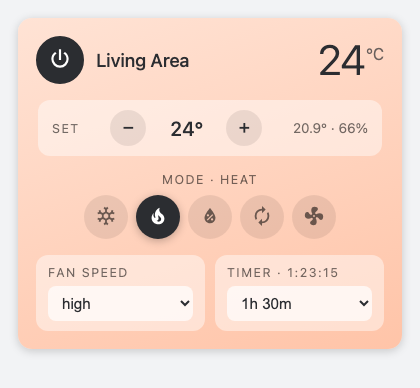
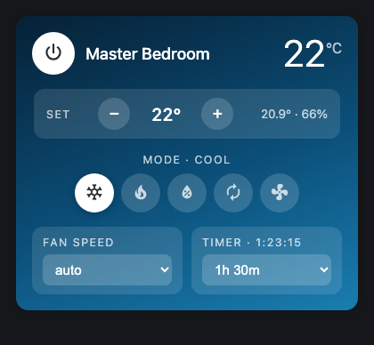
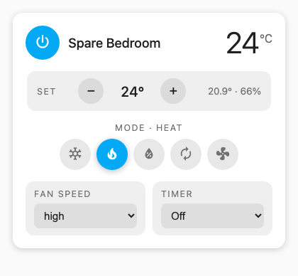

# Sensibo Thermostat Card

A thermostat-style Lovelace card for [Sensibo](https://www.home-assistant.io/integrations/sensibo/) AC controllers with a dedicated power button, mode and fan control, mode-tinted backgrounds in three selectable styles, and first-class support for Sensibo's native off-timer — set it, watch it count down, and let the device switch itself off.

<p align="center">
  
  
  
</p>
<p align="center"><sub>Pastel · Bold · Default (follows your theme)</sub></p>

The built-in thermostat card can't show Sensibo's timer, gives no at-a-glance indication of the running mode, and turning it "on" means hunting through mode buttons. This card fixes all three.

## Features

### Power, mode and fan — console style

- **Dedicated power button.** On/off lives on its own button, separate from mode selection — one obvious tap, styled after a real AC controller. The button fills when running.
- **Stage settings while off.** Tap a mode or pick a fan speed any time. While the unit is off the selections are simply staged (and highlighted); hitting power applies them. While running, changes apply immediately.
- **Mode buttons.** A round-button row for every HVAC mode the device reports — cool, heat, dry, fan-only, and heat/cool (labelled **Auto**). The section label always shows the current selection.
- **Fan speed dropdown.** Built from the device's actual `fan_modes` (quiet, low, medium, medium-high, high, auto, strong — whatever your unit supports).
- **Target temperature** with +/− controls that respect the device's min/max and step, plus live current temperature and humidity readouts.

### The off-timer

- **Timer dropdown appears when the unit is running**, sitting beside the fan dropdown. Intervals and maximum are configurable (default: 10-minute steps up to 4 hours).
- **Arms automatically at power-on** at a configurable start value (set it to 0 to disable auto-arming), using Sensibo's native `enable_timer` — the schedule lives on Sensibo's cloud, so the AC turns itself off even if Home Assistant is down at the time.
- **Live countdown** in the timer label while running.
- **Change it mid-run** — picking a new duration re-arms the timer; picking Off cancels it without stopping the AC.
- **Powering off manually resets the timer.** No orphaned schedules.

### Looks

- **Three styles, selectable in the GUI editor** (same convention as [airtouch-card](https://github.com/mycrouch/airtouch-card)):
  - `default` — no gradient; the card follows your installed HA theme.
  - `bold` — deep mode-tinted gradients with white text.
  - `pastel` — soft mode-tinted gradients with dark text.
- **Mode-tinted background** — heat, cool, dry, fan-only and auto each get their own colour, with a smooth cross-fade on change. Individual mode colours can be overridden in YAML.
- **Off keeps the last mode's colour** — like the AirTouch console, only the power button reflects the off state, so the card never flashes grey.

### Engineering niceties

- **Minimal IR commands = minimal beeps.** Power-on is sent via `sensibo.full_state` — one API call carrying the complete AC state, so the AC beeps once, not twice (`climate.set_hvac_mode` from off makes two API calls in the Sensibo integration). Mode or fan selections that match what the device is already doing send nothing at all, and the timer never sends IR.
- **No scroll-jump, no flicker.** The DOM is built once and updated in place, and a short optimistic hold after a power press smooths over the Sensibo cloud's state-bounce (on → stale off → on).
- **Zero-config entity wiring.** The timer switch and end-time sensor are derived automatically from the climate entity ID. Overrides available for exotic setups.
- **Full GUI configuration** — appears in the card picker with a visual editor for entity, name, style, and all timer settings.

## Requirements

The official [Sensibo integration](https://www.home-assistant.io/integrations/sensibo/), which provides the `climate.*` entity plus the `switch.*_timer` and `sensor.*_timer_end_time` entities this card uses.

## Installation

### HACS (recommended)

1. HACS → menu (⋮) → **Custom repositories** → add `https://github.com/mycrouch/sensibo-thermostat-card`, category **Dashboard**
2. Download **Sensibo Thermostat Card** (the Lovelace resource is registered automatically)
3. Hard-refresh your browser

### Manual

1. Copy `sensibo-thermostat-card.js` to `/config/www/`
2. Add a dashboard resource: URL `/local/sensibo-thermostat-card.js`, type **JavaScript module**

## Configuration

Everything is configurable in the GUI editor (**Add card → Sensibo Thermostat Card**). YAML equivalent:

```yaml
type: custom:sensibo-thermostat-card
entity: climate.dining_room_sensibo_living_area
name: Living Area          # optional, defaults to the entity's friendly name
style: pastel              # optional: default | bold | pastel
default_minutes: 60        # optional, timer armed at power-on (0 = none)
interval_minutes: 10       # optional, timer dropdown steps
max_minutes: 240           # optional, timer dropdown maximum
```

| Option | Default | Description |
| --- | --- | --- |
| `entity` | required | Sensibo `climate` entity |
| `name` | friendly name | Card title |
| `style` | `pastel` | `default` (follows theme), `bold`, or `pastel` (`light` accepted as an alias) |
| `default_minutes` | `60` | Timer value armed at power-on, in minutes; `0` = no timer |
| `interval_minutes` | `10` | Timer dropdown interval |
| `max_minutes` | `240` | Timer dropdown maximum |
| `timer_options` | generated | Explicit list of minute values (overrides interval/max) |
| `timer_switch` | derived | Override the `switch.*_timer` entity |
| `timer_end` | derived | Override the `sensor.*_timer_end_time` entity |
| `colors` | built-in | Per-mode CSS background overrides, e.g. `heat: "linear-gradient(145deg,#fdd,#fba)"` |

### Timer behaviour in detail

The timer dropdown is hidden while the unit is off. Powering on from the card arms Sensibo's native off-timer at `default_minutes` and the label becomes a live countdown. Changing the dropdown mid-run re-arms at the new duration; selecting Off cancels the timer while the AC keeps running; powering off manually cancels and resets it. Because the schedule runs on Sensibo's cloud rather than in Home Assistant, the shutdown fires even if HA is restarting.

Powering on from the Sensibo app or an IR remote does not arm the timer — if you want that, pair the card with a small automation that calls `sensibo.enable_timer` when the climate entity leaves `off`.

## The mycrouch card collection

These Home Assistant Lovelace cards share a common design language — a clean **default** look that inherits your active theme, plus a per-card **theme** picker — so they sit together neatly on one dashboard. Pair any of them with **gradient-themes** for 40 ready-made gradient and pastel backgrounds.

| Project | What it is |
| --- | --- |
| [kirigami-card](https://github.com/mycrouch/kirigami-card) | Group any device's entities as a row list or chip grid |
| [pro-v-weather-card](https://github.com/mycrouch/pro-v-weather-card) | Weather-station console — clock, moon, forecast, UV, solar, wind |
| [weather-station-card](https://github.com/mycrouch/weather-station-card) | LCD-console weather station with backlight themes |
| [airtouch-card](https://github.com/mycrouch/airtouch-card) | AirTouch 4/5 AC + zone control |
| **sensibo-thermostat-card** (this card) | Sensibo thermostat with mode-coloured backgrounds |
| [ecovacs-vacuum-card](https://github.com/mycrouch/ecovacs-vacuum-card) | Ecovacs/Deebot vacuum with area cleaning |
| [gradient-themes](https://github.com/mycrouch/gradient-themes) | 40 gradient + pastel dashboard themes |

## License

MIT
